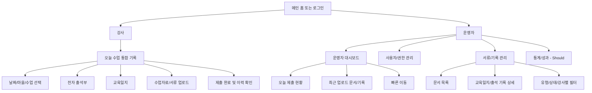
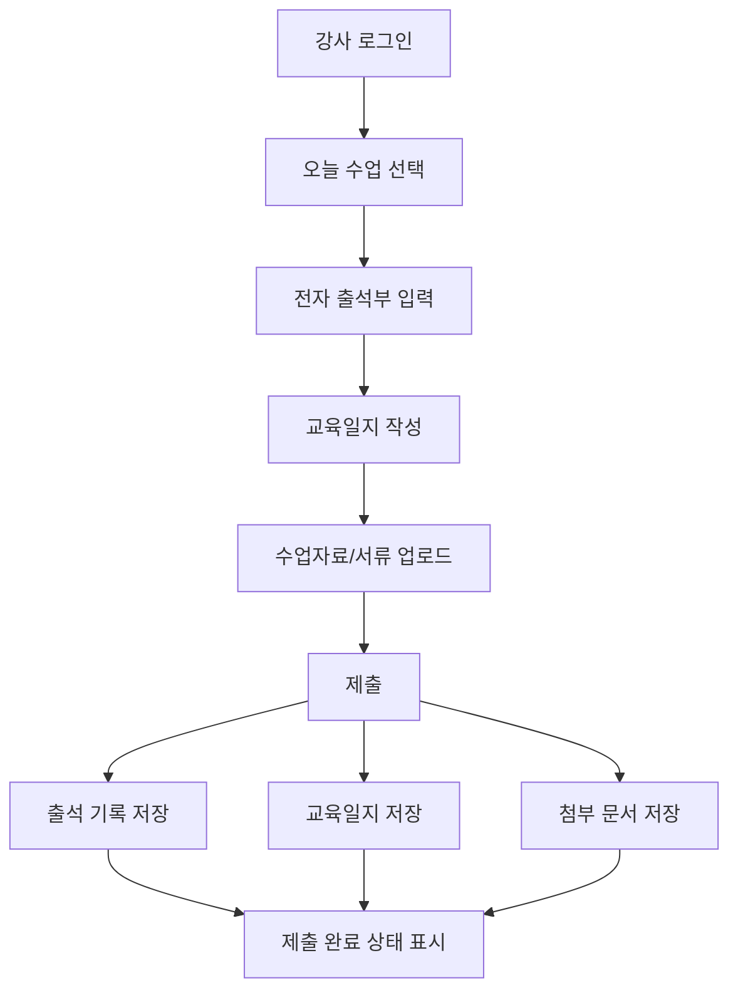
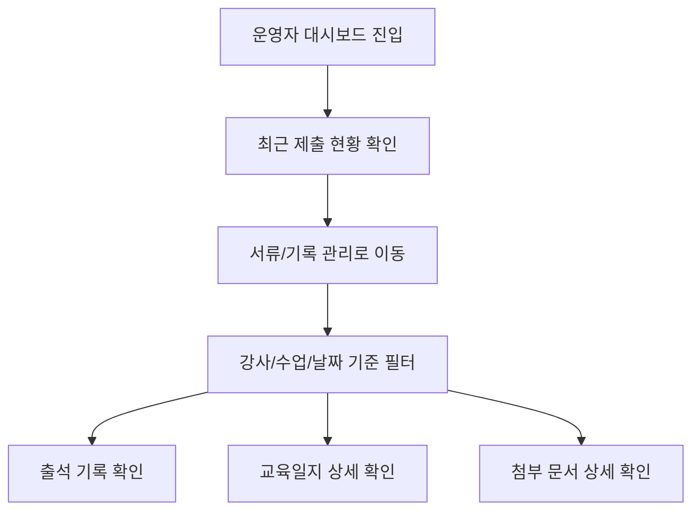
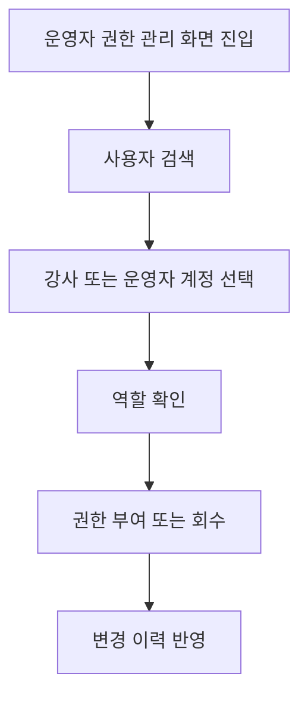
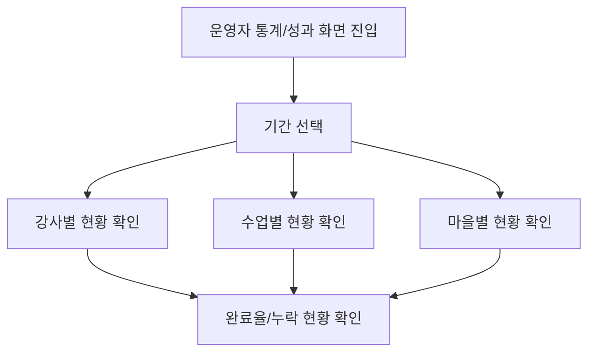

문서 기능이 너무 많다는 피드백에 맞춰, 이번 1차 MVP는 `학생·부모 기능을 본체에서 제외`하고 `운영자-강사를 위한 시스템`에 먼저 맞추어 PRD를 재작성한다. 즉, 지금 단계의 핵심은 `수업 운영 기록`, `전자 출석`, `교육일지`, `수업자료/서류 업로드`, `운영자 기록 관리`를 한 시스템 안에서 먼저 안정적으로 굴리는 것이다.

  

---

  

## 문서 전제

1. 1차 MVP의 핵심 사용자 역할은 `운영자`와 `강사`다.

2. 학생·부모·학부모 대표 관련 기능은 이번 문서의 본문 IA/플로우/화면명세에서 제외하고 `Could Have`로만 남긴다.

3. 1차 MVP의 핵심 문제는 `운영자-강사 간 행정 흐름 단절`과 `수업 기록/서류 관리의 비효율`이다.

4. 강사 화면은 `오늘 수업 통합 기록` 하나를 중심으로 `전자 출석부 + 교육일지 + 수업자료/서류 업로드`를 바로 이어서 제출하는 구조로 설계한다.

5. `특이사항`은 기능 우선순위를 낮추고 2차 범위로 미룬다.

6. `통계/성과`는 1차 MVP 본체보다는 한 단계 뒤의 확장 기능으로 보고 `Should Have`로 둔다.

---

## MVP 범위 정리

### Must Have

  
1. 운영자 대시보드

2. 사용자/권한 관리

3. 강사용 오늘 수업 통합 기록

4. 전자 출석부

5. 교육일지 즉시 제출

6. 수업자료/서류 업로드

7. 운영자 서류/기록 관리

8. 강사 제출 이력과 문서 상세 조회

### Should Have

1. 통계/성과 대시보드

2. 강사별/수업별/마을별 누적 운영 현황 비교

3. 출석, 교육일지, 문서 업로드 기준의 완료율/누락 현황 집계

### Could Have

1. 강사 특이사항 기록

2. 보호자 공유용 활동 요약 기능

3. 학부모용 공지/알림

4. 학부모 대표 권한 기능

5. 일정/준비물 및 투표

  

### Won't Have Yet

현재 1,2 번은 우리의 타켓층에서 벗어낫기에 제외를 하였습니다. 하지만 과연 이 부분이 없이 서비스의 노벨티가 있을지에 대해서 의문이 있습니다. 그렇기에 이 부분에 대해서 필요한지에 대해서 피드백을 받고 싶습니다.
1. 학생용 활동 회고/기록 앱
2. 학부모용 모바일 앱 본체
3. 고도화된 AI 분석/추천
4. 과도한 게임화 및 소셜 기능
5. 외부 드라이브 연동 고도화

  

---

  

## 역할 정의

  

| 역할  | 핵심 목적                  | 1차 MVP 핵심 행동                                 |
| --- | ---------------------- | -------------------------------------------- |
| 강사  | 수업 운영 데이터를 빠르게 입력하고 제출 | 수업 선택, 전자 출석 입력, 교육일지 작성, 수업자료/서류 업로드, 제출 완료 |
| 운영자 | 전체 운영 기록과 권한을 통합 관리    | 대시보드 확인, 사용자/권한 관리, 서류/기록 검토, 운영 현황 및 성과 확인  |

  

---

  

## 2-2. 정보구조도

  

### IA 설계 원칙

  

1. 1차 MVP에서는 `운영자`와 `강사`만을 기준으로 진입 구조를 단순하게 잡는다.

2. 강사 경험의 중심은 `오늘 수업 통합 기록` 한 화면이다.

3. 운영자 경험의 중심은 `대시보드 -> 권한 관리 -> 서류/기록 관리`의 관리 흐름이다.

4. `Must` 기능만으로도 실제 운영이 가능하도록 IA를 설계하고, `Should/Could`는 확장 메뉴로 분리한다.

  

### 전체 IA 개요

  

  

### 1 Depth

  

| Depth | 메뉴          | 설명         | 우선순위 |
| ----- | ----------- | ---------- | ---- |
| 1     | 메인 홈 또는 로그인 | 역할별 진입     | Must |
| 1     | 강사          | 수업 운영 입력 웹 | Must |
| 1     | 운영자         | 운영 관리 웹    | Must |

  

### 2 Depth

  

| 영역  | 2 Depth     | 설명                    | 우선순위   |
| --- | ----------- | --------------------- | ------ |
| 강사  | 오늘 수업 통합 기록 | 강사 핵심 입력 허브           | Must   |
| 강사  | 제출 이력 확인    | 최근 제출 결과 확인           | Must   |
| 운영자 | 대시보드        | 오늘 운영 현황 요약           | Must   |
| 운영자 | 사용자/권한 관리   | 역할과 접근 권한 제어          | Must   |
| 운영자 | 서류/기록 관리    | 출석, 교육일지, 첨부 문서 통합 관리 | Must   |
| 운영자 | 통계/성과       | 강사/수업/마을 기준 누적 현황     | Should |

  

### 3 Depth

  

| 상위 메뉴 | 3 Depth | 설명 | 우선순위 |
|---|---|---|---|
| 강사 > 오늘 수업 통합 기록 | 날짜/마을/수업 선택 | 오늘 기록 대상 선택 | Must |
| 강사 > 오늘 수업 통합 기록 | 전자 출석부 | 출석/결석/지각 입력 | Must |
| 강사 > 오늘 수업 통합 기록 | 교육일지 | 수업 요약 및 제출 내용 작성 | Must |
| 강사 > 오늘 수업 통합 기록 | 수업자료/서류 업로드 | 자료 및 운영 서류 첨부 | Must |
| 강사 > 오늘 수업 통합 기록 | 제출 완료 | 제출 시각 및 상태 확인 | Must |
| 운영자 > 대시보드 | 제출 현황 카드 | 오늘 제출/미제출 현황 | Must |
| 운영자 > 대시보드 | 최근 기록 | 최근 업로드/제출 내역 | Must |
| 운영자 > 사용자/권한 관리 | 사용자 목록 | 강사/운영자 계정 조회 | Must |
| 운영자 > 사용자/권한 관리 | 권한 부여/회수 | 역할 변경 | Must |
| 운영자 > 서류/기록 관리 | 문서 목록 | 업로드 문서 리스트 | Must |
| 운영자 > 서류/기록 관리 | 교육일지 상세 | 제출된 일지 확인 | Must |
| 운영자 > 서류/기록 관리 | 출석 기록 상세 | 세션별 출석 확인 | Must |
| 운영자 > 통계/성과 | 강사별 누적 현황 | 강사 기준 비교 | Should |
| 운영자 > 통계/성과 | 수업별/마을별 성과 | 운영 단위 비교 | Should |

  

---

  

## 2-3. 핵심 플로우 정의

  

### 플로우 설계 원칙

  

1. 메인 플로우는 실제 운영에서 가장 자주 쓰는 `강사 입력 -> 운영자 관리` 흐름으로 고정한다.

2. 실패 경로는 세부 예외 정책으로 분리하고, 본 플로우는 Happy Path 기준으로 작성한다.

3. 학생·부모 관련 플로우는 이번 문서 본문에서 제외한다.

  

### F1. 강사 오늘 수업 통합 기록 제출 플로우

  

  

### F2. 운영자 서류/기록 관리 플로우

  

  

### F3. 운영자 사용자/권한 관리 플로우

  

  

### F4. 운영자 통계/성과 확인 플로우

  

  

---

  

## 예외 처리 정책 메모

  

| 구분 | 상황 | 처리 원칙 |
|---|---|---|
| 강사 입력 | 필수값 누락 | 제출 불가, 누락 항목 강조 |
| 강사 입력 | 파일 업로드 실패 | 개별 파일 재시도 안내 |
| 강사 입력 | 네트워크 오류 | 저장 실패 안내 및 재시도 |
| 운영자 조회 | 기록 없음 | 빈 상태 화면과 안내 문구 제공 |
| 운영자 권한 | 권한 없는 접근 | 접근 차단 및 권한 안내 |
| 통계/성과 | 집계 대상 없음 | 0건 상태와 기간 변경 유도 |
  

---

  

## 2-4. 화면 설계와 비즈니스 로직

  

## 화면 목록

  

| 화면 ID | 화면명         | 역할  | 우선순위   |
| ----- | ----------- | --- | ------ |
| HM-01 | 메인 홈 또는 로그인 | 공통  | Must   |
| TE-01 | 오늘 수업 통합 기록 | 강사  | Must   |
| AD-01 | 운영자 대시보드    | 운영자 | Must   |
| AD-02 | 사용자/권한 관리   | 운영자 | Must   |
| AD-03 | 서류/기록 관리    | 운영자 | Must   |
| AD-04 | 통계/성과       | 운영자 | Should |

  

### HM-01 메인 홈 또는 로그인

  

**목적**

  
서비스 진입 후 사용자가 자신의 역할에 맞는 영역으로 바로 이동하도록 돕는다.

**핵심 UI**
1. 서비스 소개 요약

2. 역할 선택 또는 로그인 진입

3. 강사/운영자 진입 버튼

**비즈니스 로직**
1. 로그인 이후 역할에 맞는 기본 홈으로 이동한다.

2. 권한이 없는 역할 메뉴는 노출하지 않거나 접근을 차단한다.

  

### TE-01 오늘 수업 통합 기록

**목적**
강사가 오늘 해야 하는 핵심 입력 작업을 한 흐름에서 끝낼 수 있도록 한다.

**핵심 UI**
1. 날짜/마을/수업 선택
2. 참여자 리스트 및 전자 출석부
3. 교육일지 입력 영역
4. 수업자료/서류 업로드 영역
5. 제출 버튼
6. 제출 완료 상태 및 최근 이력

  

**비즈니스 로직**

1. 본 화면은 `전자 출석부 + 교육일지 + 수업자료/서류 업로드`를 한 번에 처리하는 강사 핵심 화면이다.
2. 날짜, 마을 또는 수업, 참여자 출석 상태, 교육일지 필수 항목은 제출 시 반드시 입력되어야 한다.
3. 제출 시 `출석 기록`, `교육일지`, `첨부 문서`가 하나의 수업 단위 기록으로 함께 저장된다.
4. 제출 완료 후 제출 시각과 대상 수업 기준으로 이력이 남는다.
5. `특이사항`은 본 MVP 범위에서 제외하며, 2차 기능으로 별도 검토한다.

  

**예외/정책**
1. 필수값 누락 시 제출할 수 없다.
2. 파일 업로드 실패 시 전체 제출을 막지 않고 실패한 파일만 재시도하게 할지 여부는 구현 시점에 판단하되, 최소한 실패 안내는 제공해야 한다.
3. 미제출 상태로 이탈할 때 경고가 필요하다.
  

### AD-01 운영자 대시보드

**목적**

운영자가 오늘 운영 상태를 즉시 파악하고 필요한 관리 화면으로 빠르게 이동하도록 한다.

**핵심 UI**
1. 오늘 제출 현황 카드

2. 미제출/완료 현황 요약

3. 최근 업로드 문서 및 최근 교육일지

4. 사용자/권한 관리, 서류/기록 관리로 가는 빠른 이동

  

**비즈니스 로직**

  

1. 오늘 기준 제출 완료 건수와 미제출 건수를 우선 노출한다.

2. 최근 제출 내역은 최신순으로 정렬한다.

3. 대시보드는 상세 관리 화면으로 들어가기 전 운영 상태를 요약하는 역할에 집중한다.

  

### AD-02 사용자/권한 관리

  

**목적**

  

운영자가 강사와 운영자 계정의 역할 및 접근 권한을 관리한다.

  

**핵심 UI**

  

1. 사용자 목록

2. 역할 필터

3. 권한 변경 액션

4. 사용자 상세 정보

  

**비즈니스 로직**

  

1. 운영자는 사용자별 역할을 부여하거나 회수할 수 있어야 한다.

2. 강사 계정은 담당 마을/수업 기준으로 권한 범위를 가질 수 있다.

3. 권한 변경 이후 즉시 반영되도록 한다.

  

**예외/정책**

  

1. 자기 자신의 최고 권한을 실수로 제거하는 상황은 별도 방어가 필요하다.

  

### AD-03 서류/기록 관리

  

**목적**

  

운영자가 강사가 제출한 출석, 교육일지, 첨부 문서를 한 곳에서 통합 관리한다.

  

**핵심 UI**

  

1. 기록 목록

2. 유형 필터

3. 강사/수업/마을/날짜 필터

4. 상세 보기

  

**비즈니스 로직**

  

1. 출석 기록, 교육일지, 첨부 문서는 같은 수업 단위 기록 아래에서 연결되어 조회 가능해야 한다.

2. 운영자는 목록에서 기본 메타데이터를 먼저 확인하고 상세 화면으로 들어갈 수 있어야 한다.

3. 검색과 필터를 통해 특정 강사, 특정 수업, 특정 기간 기록을 빠르게 찾을 수 있어야 한다.

  

**예외/정책**

  

1. 첨부 문서가 없는 기록은 빈 상태로 표시하되 오류로 취급하지 않는다.

  

### AD-04 통계/성과

  

**목적**

  

운영자가 운영 현황을 단순 조회를 넘어 비교와 누적 관점으로 확인하도록 돕는다.

  

**핵심 UI**

  

1. 기간 선택

2. 강사별 누적 현황

3. 수업별 누적 현황

4. 마을별 누적 현황

5. 완료율/누락 현황

  

**비즈니스 로직**

  

1. 통계 기준은 최소한 `강사`, `수업`, `마을`, `기간` 축으로 조회 가능해야 한다.

2. 성과 지표는 최소한 `출석 입력 건수`, `교육일지 제출 건수`, `문서 업로드 건수`, `완료율`, `누락 현황`을 포함한다.

3. 본 화면은 1차 MVP의 본체가 아니라 운영 안정화 이후 바로 붙일 확장 화면으로 본다.

  

---

  

## 회의용 정리 포인트

  

1. 기능이 너무 많다는 피드백에 맞춰, 이번 1차 MVP PRD는 `운영자-강사를 위한 시스템`에 먼저 맞추어 다시 정리했다.

2. 학생·부모 기능은 중요하지만 지금 당장 구현해야 할 본체가 아니라 `Could Have`로 뒤로 미뤘다.

3. 이번 MVP의 중심축은 `강사의 수업 기록 제출`과 `운영자의 기록 관리`다.

4. 강사 화면은 `전자 출석부 + 교육일지 + 수업자료/서류 업로드`를 한 흐름에서 끝내는 통합형 구조가 핵심이다.

5. 운영자 화면은 `대시보드`, `사용자/권한 관리`, `서류/기록 관리`를 우선 고정하고 `통계/성과`는 그다음 단계로 둔다.

  

---

  

## 현재 남아 있는 확인 필요 사항

실제로 다로리인 대표님과 미팅을 통하여 현재 서류 제출 프로세스에 대해서 정교화 예정->그 후 관련 서류 제출 로직은 수정할 예정입니다. 
